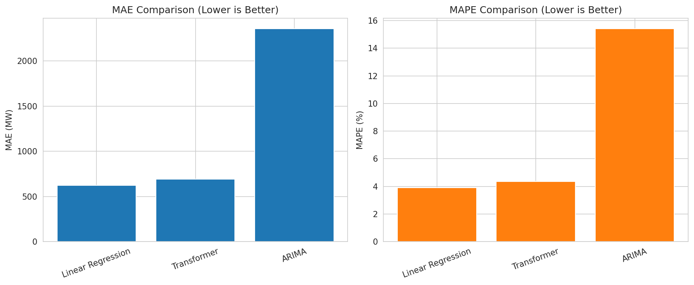
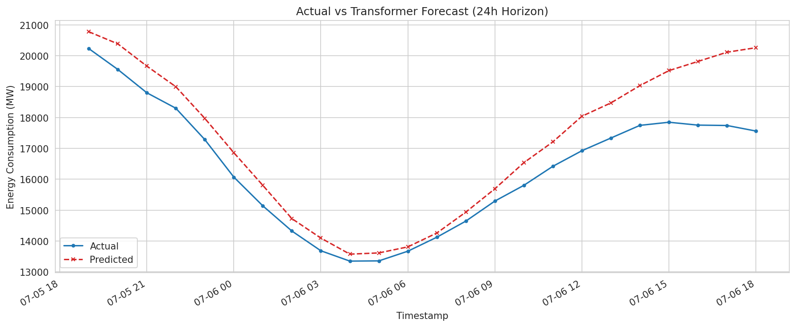
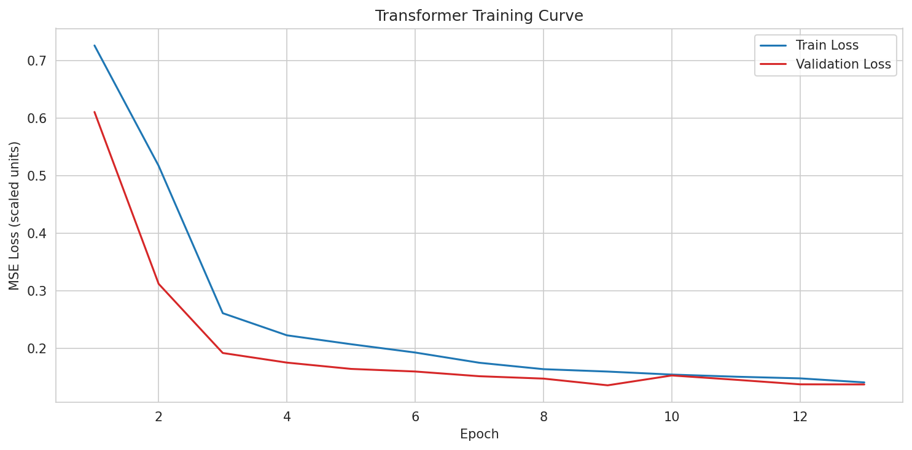
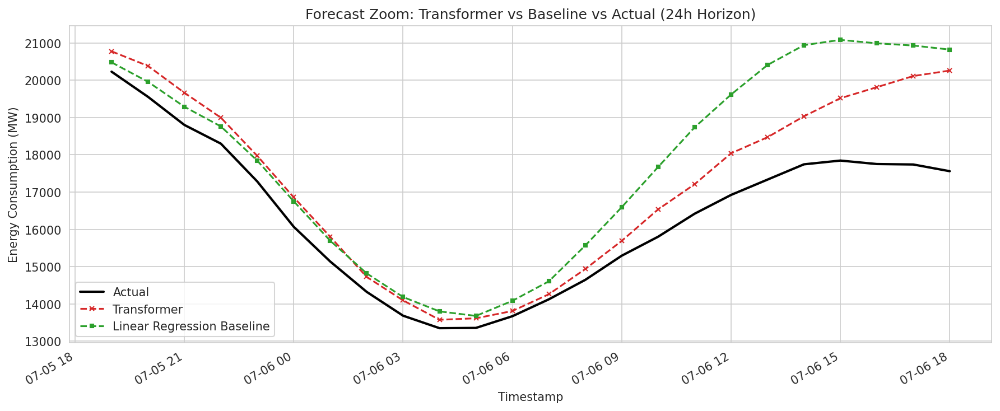

# ⚡ Transformer for Time-Series Forecasting

> **24-hour electricity demand forecasting using a PyTorch Transformer, benchmarked against Linear Regression and ARIMA.**

An end-to-end, **notebook-free time-series forecasting project** that uses the past **168 hours (7 days)** of hourly electricity demand to predict the **next 24 hours**.

The project implements a Transformer Encoder from scratch using PyTorch and compares it against classical forecasting approaches under the **same chronological train/validation/test setup**.

The key result is intentionally honest: **Linear Regression outperformed the Transformer on this dataset and forecasting horizon**, demonstrating why strong baselines matter in applied machine learning.

---

## 📊 Results at a Glance

| Model                    |         MAE ↓ |    MAPE ↓ |
| ------------------------ | ------------: | --------: |
| 🥇 **Linear Regression** | **623.90 MW** | **3.92%** |
| Transformer              |     692.66 MW |     4.35% |
| ARIMA                    |    2356.99 MW |    15.41% |

### 🏆 Best Model: Linear Regression

The Transformer achieved competitive performance but did **not** outperform the simpler lag-based Linear Regression model.

This is an important result rather than a failure: the dataset is relatively small, strongly autocorrelated, univariate, and dominated by short-term temporal patterns where a linear lag model is already highly effective.

---

## 🔍 Project Overview

### Problem

Given:

```text
Past 7 days = 168 hourly observations
                ↓
        Transformer Encoder
                ↓
Next 24 hours = 24 predictions
```

The model learns temporal patterns from historical electricity demand and directly predicts the following 24 hourly values.

The project evaluates whether attention-based modeling provides an advantage over simpler classical approaches.

---

## 🧠 Why This Project?

Electricity demand contains strong:

* Daily patterns
* Weekly patterns
* Short-term autocorrelation
* Seasonal behavior
* Peak/off-peak demand cycles

This makes energy forecasting a useful real-world setting for testing whether Transformer-based attention can capture temporal relationships better than traditional forecasting techniques.

---

## 🏗️ Architecture

```text
                    ┌─────────────────────┐
                    │  PJM Energy Dataset │
                    │  Hourly Demand (MW) │
                    └──────────┬──────────┘
                               │
                               ▼
                    ┌─────────────────────┐
                    │ Chronological Split │
                    │   70% / 15% / 15%   │
                    └──────────┬──────────┘
                               │
                               ▼
                    ┌─────────────────────┐
                    │ StandardScaler      │
                    │ Train Data Only     │
                    └──────────┬──────────┘
                               │
                               ▼
                    ┌─────────────────────┐
                    │ Sliding Windows     │
                    │ 168h → 24h          │
                    └──────────┬──────────┘
                               │
                               ▼
                 ┌───────────────────────────┐
                 │     Transformer Encoder   │
                 │                           │
                 │ Input Projection 1 → 64  │
                 │ Sinusoidal Position Enc.  │
                 │ 2 Encoder Layers          │
                 │ 4 Attention Heads         │
                 │ d_model = 64              │
                 └─────────────┬─────────────┘
                               │
                               ▼
                    ┌─────────────────────┐
                    │ Forecasting Head    │
                    │ Mean Pool → MLP     │
                    │ 24 Outputs          │
                    └──────────┬──────────┘
                               │
                               ▼
                    ┌─────────────────────┐
                    │ Inverse Scaling     │
                    │ MAE / MAPE          │
                    └─────────────────────┘
```

---

## 🧪 Models Compared

### 1. Transformer Encoder

A compact Transformer architecture implemented in PyTorch.

**Configuration**

* Input sequence: `168 hours`
* Forecast horizon: `24 hours`
* `d_model = 64`
* Attention heads: `4`
* Encoder layers: `2`
* Sinusoidal positional encoding
* Mean pooling
* MLP forecasting head
* Early stopping
* Best-model checkpointing

---

### 2. Linear Regression

A strong classical baseline using the previous **168 hourly observations as lag features**.

```text
[t-168, t-167, ..., t-2, t-1]
                    ↓
          Linear Regression
                    ↓
[t+1, t+2, ..., t+24]
```

The model uses the same input windows and test sequences as the Transformer.

---

### 3. ARIMA(5,1,0)

An autoregressive statistical baseline.

ARIMA was rolled forward to produce 24-hour forecasts from a representative **150-window test subsample** because evaluating every test window with a fresh ARIMA fit was computationally impractical on the single-core CPU setup.

---

## 📈 Forecast Error by Horizon

| Forecast Horizon | Transformer | Linear Regression |
| ---------------- | ----------: | ----------------: |
| +1 hour          |   341.21 MW |     **108.92 MW** |
| +24 hours        |   864.60 MW |     **760.72 MW** |

Both models become less accurate as the forecast horizon increases.

Linear Regression has a particularly strong advantage at the immediate +1 hour horizon, while the difference becomes considerably smaller at +24 hours.

---

## 💡 What Did We Learn?

### Where Attention Can Help

Self-attention can theoretically provide advantages when the forecasting problem contains:

* Long-range dependencies
* Multiple periodicities
* Complex temporal relationships
* Non-adjacent dependencies
* Rich multivariate inputs

For example, attention could learn relationships between today's peak demand and a similar peak several days earlier.

### Why It Didn't Win Here

The Transformer did not outperform Linear Regression on this particular experiment.

Possible reasons include:

**1. Limited training data**

Approximately 6,800 training sequences were available, which is relatively small for deep learning.

**2. Strong local autocorrelation**

Electricity demand is highly dependent on recent observations, making lag-based models extremely competitive.

**3. Limited computational budget**

The Transformer was intentionally kept small and trained on a single CPU core.

**4. Univariate input**

The model only receives historical demand values. No weather, holiday, calendar, or other external variables are provided.

### Key Takeaway

> **More complex models are not automatically better models.**

A well-designed baseline can outperform a sophisticated architecture when the underlying problem structure is simple enough.

---

## 🗂️ Dataset

**PJM Hourly Energy Consumption — AEP Zone**

The dataset contains hourly electricity demand measurements in megawatts (MW).

Original dataset:

https://www.kaggle.com/datasets/robikscube/hourly-energy-consumption

The complete dataset spans:

```text
2004-10-01 → 2018-08-03
121,273 hourly observations
```

For practical CPU-based experimentation, the project uses approximately the most recent **10,000 hourly observations (~14 months)**.

---

## 🔐 Preventing Data Leakage

Time-series data should **not** be randomly shuffled before splitting.

This project uses:

```text
                 Chronological Order
─────────────────────────────────────────────────────►

|──────────────|──────────|──────────|
|    Train     |   Val    |   Test   |
|     70%      |   15%    |   15%    |
|──────────────|──────────|──────────|
       Past                  Future
```

The scaler is also fitted **only on the training data**.

This prevents future information from leaking into the training process and produces a more realistic evaluation.

---

## 📊 Visualizations

The project generates multiple visualizations covering:

* Original time series
* Recent demand segment
* Rolling statistics
* Distribution analysis
* Seasonal patterns
* Transformer training loss
* Transformer forecasts
* Baseline forecasts
* Model comparison
* Forecast zoom
* Error by forecast horizon

### Model Comparison



### Transformer Forecast



### Training Loss



### Forecast Zoom



---

## ⚙️ Tech Stack

| Technology       | Purpose                     |
| ---------------- | --------------------------- |
| **Python**       | Core language               |
| **PyTorch**      | Transformer implementation  |
| **Pandas**       | Data processing             |
| **NumPy**        | Numerical computation       |
| **Scikit-learn** | Scaling & Linear Regression |
| **Statsmodels**  | ARIMA                       |
| **Matplotlib**   | Visualization               |

---

## 🚀 Installation

Clone the repository:

```bash
git clone https://github.com/Sarthak0521/transformer-time-series-forecasting.git

cd transformer-time-series-forecasting
```

Install dependencies:

```bash
pip install -r requirements.txt
```

---

## 📥 Dataset Setup

Place the downloaded dataset at:

```text
data/AEP_hourly.csv
```

Dataset instructions are also available in:

```text
data/README.md
```

---

## ▶️ Run the Project

From the project root:

```bash
python main.py
```

The pipeline will:

```text
Load dataset
     ↓
Run EDA
     ↓
Chronological train/validation/test split
     ↓
Scale using training data
     ↓
Create 168h → 24h windows
     ↓
Train Transformer
     ↓
Train Linear Regression
     ↓
Train ARIMA
     ↓
Evaluate MAE / MAPE
     ↓
Generate visualizations
     ↓
Save metrics
     ↓
Save best Transformer checkpoint
```

Approximate runtime on the original setup:

```text
~13 minutes
Single CPU core
```

---

## 📁 Project Structure

```text
transformer-time-series-forecasting/
│
├── data/
│   ├── AEP_hourly.csv
│   └── README.md
│
├── models/
│   └── best_transformer.pt
│
├── results/
│   ├── figures/
│   │   ├── time_series.png
│   │   ├── recent_segment.png
│   │   ├── rolling_statistics.png
│   │   ├── distribution.png
│   │   ├── seasonal_patterns.png
│   │   ├── training_loss.png
│   │   ├── transformer_forecast.png
│   │   ├── baseline_forecast.png
│   │   ├── model_comparison.png
│   │   ├── forecast_zoom.png
│   │   ├── transformer_error_by_horizon.png
│   │   └── baseline_error_by_horizon.png
│   │
│   └── metrics/
│       └── model_comparison.csv
│
├── src/
│   ├── config.py
│   ├── data_loader.py
│   ├── preprocessing.py
│   ├── dataset.py
│   ├── transformer_model.py
│   ├── baseline.py
│   ├── train.py
│   ├── evaluate.py
│   └── visualization.py
│
├── main.py
├── requirements.txt
└── README.md
```

---

## ⚠️ Limitations

* Univariate forecasting only
* Single energy zone (AEP)
* No weather information
* No explicit holiday/calendar features
* Transformer trained with a deliberately small computational budget
* ARIMA evaluated on a 150-window subsample
* Direct multi-step forecasting rather than autoregressive decoding
* Results may not generalize to other regions or datasets

---

## 🔮 Future Improvements

### Data

* Add temperature
* Add humidity
* Add holidays
* Add day-of-week
* Add hour-of-day
* Add additional energy zones

### Models

Compare against:

* Temporal Fusion Transformer
* Informer
* PatchTST
* Sequence-to-sequence Transformers

### Forecasting

* 72-hour forecasting
* 168-hour forecasting
* Probabilistic forecasting
* Prediction intervals

### Optimization

* Automated hyperparameter tuning
* Larger training datasets
* GPU-based training
* Feature engineering experiments

---

## 🎯 Conclusion

This project demonstrates an important practical lesson in time-series machine learning:

**A more sophisticated architecture does not guarantee better forecasting performance.**

On this dataset and 24-hour forecasting horizon, **Linear Regression achieved the best overall performance**, while the Transformer remained competitive.

The experiment therefore focuses not only on implementing a Transformer, but on **fair benchmarking, leakage-free evaluation, error analysis, and honest interpretation of model performance**.

---

## 👨‍💻 Author

**Sarthak Patil**

Computer Science Undergraduate | Machine Learning | AI | Software Development

---

⭐ If you found this project useful, consider giving the repository a star!
